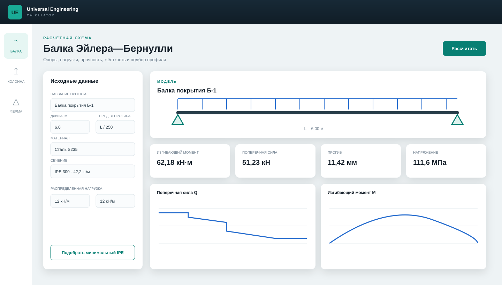

# Universal Engineering Calculator

[](https://github.com/Mika-dot/Beam-load-calculation/actions/workflows/ci.yml)


**Universal Engineering Calculator (UEC)** — полностью переработанный инженерный расчётный комплекс вместо исходной программы для одной учебной балки. Приложение рассчитывает произвольные балки методом конечных элементов, плоские фермы, устойчивость колонн, проверяет прочность и жёсткость, подбирает профиль и формирует инженерный отчёт.



## Что уже реализовано

| Модуль | Возможности |
|---|---|
| Балки | произвольная длина; шарнир, каток, защемление, консоль и промежуточные опоры; многопролётные схемы |
| Нагрузки | сосредоточенные силы, моменты, постоянные и линейно меняющиеся распределённые нагрузки, собственный вес |
| Результаты | реакции, эпюры `Q` и `M`, прогибы, углы поворота, напряжения, коэффициент запаса, использование прочности и жёсткости |
| Фермы | плоская стержневая КЭ-модель, перемещения узлов, реакции, продольные силы и напряжения |
| Колонны | критическая сила Эйлера, расчётная длина для четырёх закреплений, гибкость, прочность и устойчивость |
| Сечения | IPE 100–600, прямоугольник, круг, прямоугольная и круглая труба, параметрический двутавр |
| Материалы | S235, S355, алюминий 6061-T6, древесина C24, бетон C30/37, пользовательские параметры через ядро |
| Подбор | автоматический выбор самого лёгкого подходящего профиля IPE по прочности и прогибу |
| Отчёты | печать/PDF из браузера, автономный HTML с SVG-эпюрами, CSV и JSON |
| Интерфейсы | адаптивный веб-интерфейс, CLI, HTTP API, библиотека .NET |

## Быстрый запуск

Требуется [.NET 8 SDK](https://dotnet.microsoft.com/download/dotnet/8.0).

### Windows

```powershell
git clone https://github.com/Mika-dot/Beam-load-calculation.git
cd Beam-load-calculation
git switch feature/universal-engineering-calculator
powershell -ExecutionPolicy Bypass -File .\scripts\start.ps1
```

Откройте **http://127.0.0.1:5080**. Интерфейс сразу загрузит демонстрационную схему и выполнит расчёт.

### Linux/macOS

```bash
git clone https://github.com/Mika-dot/Beam-load-calculation.git
cd Beam-load-calculation
git switch feature/universal-engineering-calculator
sh scripts/start.sh
```

## Командная строка

```bash
# расчёт примера + HTML/CSV/JSON в reports/
dotnet run --project src/EngineeringCalculator.Cli -- demo

# расчёт собственной схемы
dotnet run --project src/EngineeringCalculator.Cli -- \
  beam --input samples/beam.json --output reports/beam-01

# автоматический подбор IPE
dotnet run --project src/EngineeringCalculator.Cli -- \
  select --input samples/beam.json

# каталог профилей и пример фермы
dotnet run --project src/EngineeringCalculator.Cli -- profiles
dotnet run --project src/EngineeringCalculator.Cli -- truss-demo
```

Формат входного файла полностью показан в [`samples/beam.json`](samples/beam.json). Силы задаются в кН, распределённые нагрузки — в кН/м, моменты — в кН·м, геометрия — в метрах.

## Проверка проекта

```bash
dotnet restore EngineeringCalculator.sln
dotnet build EngineeringCalculator.sln -c Release --no-restore
dotnet run --project tests/EngineeringCalculator.Tests -c Release
```

Набор самопроверок сверяет решатель с аналитическими решениями для равномерно нагруженной балки, центральной силы, консоли и треугольной нагрузки; отдельно проверяет равновесие фермы, формулу Эйлера, геометрию сечений, подбор профиля и экспорт отчётов. Те же проверки автоматически запускаются в GitHub Actions.

## Архитектура

```text
src/
├── EngineeringCalculator.Core/   расчётное ядро без UI и внешних пакетов
│   ├── Beams/                    КЭ-решатель балок и подбор сечений
│   ├── Trusses/                  КЭ-решатель плоских ферм
│   ├── Columns/                  устойчивость колонн
│   ├── Materials/                каталог материалов
│   ├── Sections/                 геометрия и сортамент
│   ├── Reports/                  HTML, SVG, CSV, JSON
│   └── Contracts/                входные DTO
├── EngineeringCalculator.Web/    веб-интерфейс и HTTP API
└── EngineeringCalculator.Cli/    пакетные расчёты
tests/EngineeringCalculator.Tests/ аналитические и интеграционные проверки
```

Ядро не зависит от ASP.NET, UI, графических или численных NuGet-пакетов. Это позволяет использовать его в консольных программах, настольном приложении, сервисе или собственном интерфейсе.

## Документация

- [Руководство пользователя](docs/USER_GUIDE.md)
- [Формулы, знаки и допущения](docs/FORMULAS.md)
- [Архитектура и расширение](docs/ARCHITECTURE.md)
- [HTTP API](docs/API.md)
- [Как внести изменения](CONTRIBUTING.md)

## Область применения

UEC подходит для обучения, эскизного проектирования, сравнения вариантов и независимой проверки ручного расчёта. Линейная КЭ-модель не учитывает пластичность, потерю местной устойчивости, динамику, усталость, контакт, физическую и геометрическую нелинейность. Для ответственных конструкций результат должен проверить квалифицированный инженер с учётом действующих норм, сочетаний нагрузок и коэффициентов.

## Лицензия

[MIT](LICENSE) — разрешено использование, изменение и распространение с сохранением уведомления об авторских правах.
